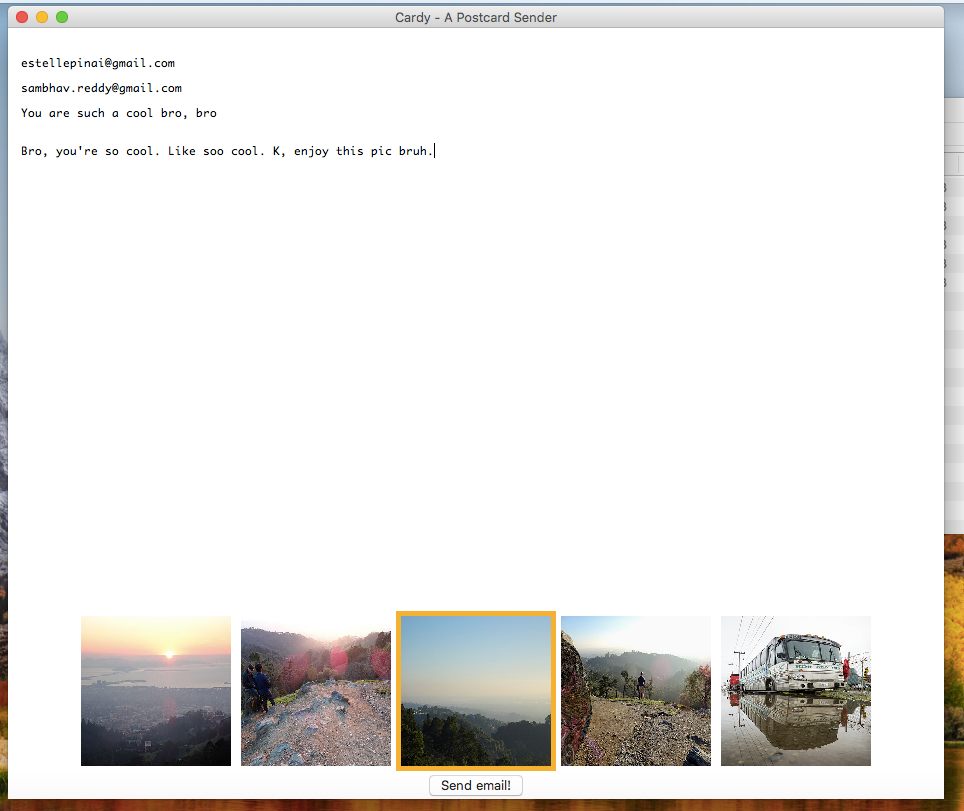

# Cardy
Cardy is an online postcard sender with a Tkinter-built GUI.

It uses your location (gotten from the Google Maps API) to find nearby scenic images (using the Flickr API) that you can send, along with a message to your friends in an email (using the Sendgrid API). 

The Cardy graphic user interface was programmed using Tkinter, the Python Tk graphics package. It runs like a desktop app rather than like a web app.

Here are some pictures of the GUI and an example postcard created with Cardy.

## User Interface

## Example Postcard

